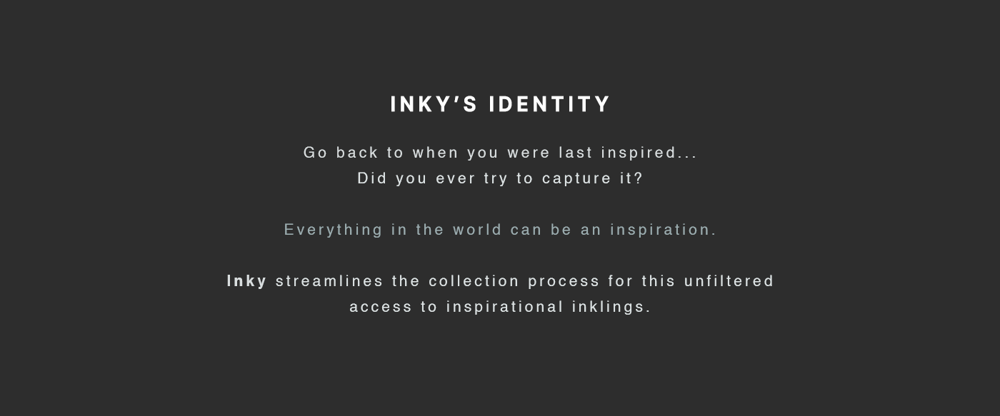
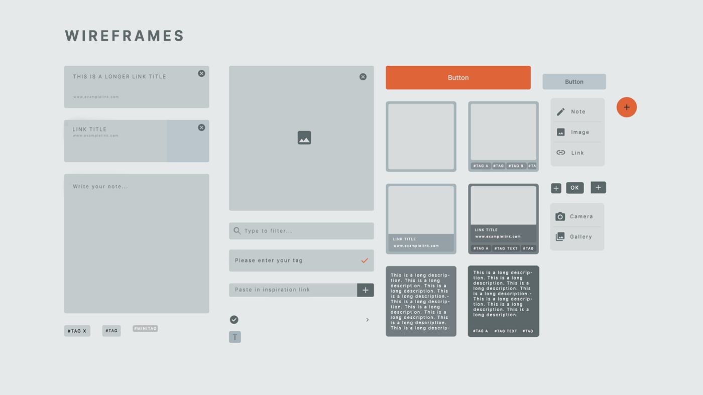

# 🖋️ Inky 

Inky is the ultimate companion for capturing and archiving your moments of inspiration. With Inky, you can effortlessly collect and store your creative inklings in one centralized place. Snap photos, save screenshots, jot down thoughts, and bookmark web links - all within the app. With intuitive organization features like tags, you can easily search and retrieve your inspirations whenever you need a spark of creativity. Embrace the limitless possibilities that await within your personalized inspiration archive.

## Table of Contents

- [🌟 Features](#-features)
- [🏗️ Architecture](#-architecture)
- [🔧 Technical Stack](#-technical-stack)
- [🚀 Getting Started](#-getting-started)
- [🤝 Contributing](#-contributing)
- [📝 License](#-license)

## 🌟 Features

Inky brings a host of engaging features to inspire and boost your creativity:

- **Streamlined Interface:** A simple and intuitive user interface designed for easy navigation and use.
- **Inspirational Archiving:** Effortlessly collect and store your creative inklings, such as photos, screenshots, thoughts, and web links.
- **Tagging System:** Use tags to easily categorize and retrieve your inspirations.
- **Bookmarking:** Save important web links directly within the app.
- **Media Support:** Snap photos or save screenshots right in your inspiration archive.
- **Search Feature:** Quickly find your saved inspirations using our efficient search feature.
- **Dark Mode:** A sleek dark theme for easy-on-the-eyes inspiration hunting at night.

## 🏗️ Architecture

Inky follows principles from Domain-Driven Design (DDD) and Clean Architecture, resulting in a layered architectural style:

- **Presentation Layer**: In Inky, this layer contains all the user interface components and user interactions. It communicates with the Application layer for action responses to user inputs.

- **Application Layer**: This layer works as the intermediary of Inky, taking user actions from the Presentation layer and directing them to the appropriate services in the Domain layer.

- **Domain Layer**: This is the core of Inky, encapsulating all the business logic. It includes the models and business rules for inspirations and tags.

- **Infrastructure Layer**: This layer is responsible for all data operations in Inky, managing data storage and retrieval through APIs and databases like Hive. It uses Dartz's `Either` type for robust error handling during data operations.

The use of Dartz `Either` type for error handling allows us to wrap computations that can potentially fail, making the system more robust and easier to debug.

## 🔧 Technical Stack

Inky is crafted using the following technology stack:

### Frontend:

- **Flutter:** A UI toolkit from Google for building natively compiled applications for mobile, web, and desktop from a single codebase.
- **Flutter Hooks:** A collection of utilities for managing state and other aspects of Flutter applications.
- **Riverpod:** A pragmatic state management library.
- **Auto Route:** An easy yet powerful routing solution, allowing for complex route patterns and transitions.

### Backend:

- **Freezed:** A code generator for unions/pattern-matching/copy in Dart.
- **Hive:** A lightweight and blazing fast key-value database written in pure Dart.
- **URL Launcher:** A Flutter plugin for launching URLs in the mobile platform.
- **Other Libraries:** adaptive_components, cupertino_icons, font_awesome_flutter and more.

## 🚀 Getting Started

1. Make sure you have [Flutter installed](https://flutter.dev/docs/get-started/install) on your local machine.
2. Clone the repository with `git clone https://github.com/freemantg/inky.git`.
3. Run `flutter packages get` in the root directory to fetch the project dependencies.
4. Finally, execute `flutter run` to run the project on your device/emulator.

## Contributing 🤝

We welcome contributions from the community. If you wish to contribute, please take a look at our contributing guidelines.

## License 📄

Inky is licensed under the MIT License. See `LICENSE` for more information.

## Contact 📞

If you have any questions or suggestions, please reach out to us at <contact@freemantang.dev>. We'd love to hear from you!
